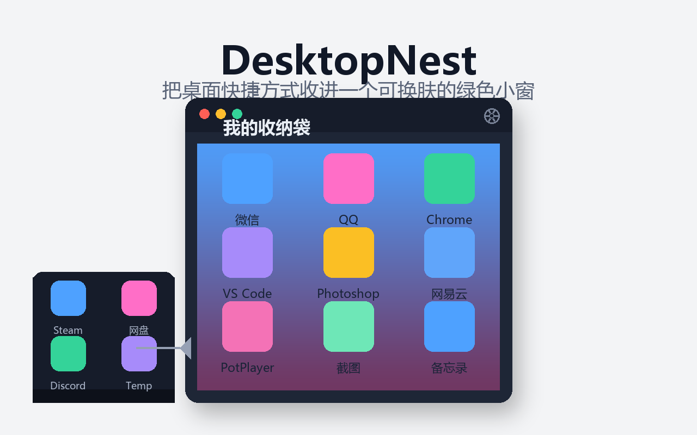
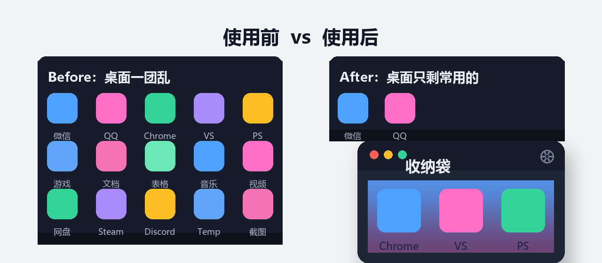

# DesktopNest

> **本仓库为 DesktopNest 唯一官方仓库**（github.com/Nico-ko-ko/DesktopNest）。任何其他网站、网盘、论坛或个人主页分发的副本均非官方，请以本仓库为准。  
> **This is the only official repository for DesktopNest** (github.com/Nico-ko-ko/DesktopNest). Copies distributed on other sites, forums, or personal pages are unofficial.

<div align="center">

**中文** | [English](#english)

[下载 / Download](https://github.com/Nico-ko-ko/DesktopNest/releases) · [GitHub](https://github.com/Nico-ko-ko/DesktopNest)

</div>



**DesktopNest** is a 96 KB portable Windows desktop organizer. Drag shortcuts into a small, skinnable window; double-click to launch, right-click to restore them to their original desktop positions.

**DesktopNest** 是一个仅 96 KB 的 Windows 桌面软件收纳工具。把桌面快捷方式拖进一个可换肤的小窗，双击启动，右键即可还原到原桌面位置。



## 核心特性 / Features

| 中文 | English |
|---|---|
| 绿色单文件，仅 96.5 KB | Single portable `.exe`, only 96.5 KB |
| 无需安装运行环境（依赖系统自带 .NET 4.8） | No runtime to install (uses system .NET 4.8) |
| 不联网、不读取用户数据 | No network access, no user data collection |
| 4–100 个收纳位，容量自由调节 | 4–100 slots, adjustable capacity |
| 纯色 / 渐变 / 图片背景，支持 GIF / APNG / 动态 WebP | Solid / gradient / image background, GIF / APNG / animated WebP |
| 移出时自动回到原桌面位置 | Restores icons to their original desktop position |
| 数据本地保存，原子写入 | Data saved locally with atomic writes |

## 下载 / Download

直接下载最新 Release：

**[github.com/Nico-ko-ko/DesktopNest/releases](https://github.com/Nico-ko-ko/DesktopNest/releases)**

## 快速开始 / Quick Start

### 中文

1. 下载 `DesktopNest.exe` 并双击运行。
2. 把桌面快捷方式拖进窗口。
3. 双击图标启动，右键图标移出收纳。

### English

1. Download `DesktopNest.exe` and double-click to run.
2. Drag shortcuts from the desktop into the window.
3. Double-click an icon to launch; right-click to remove it from the organizer.

## 使用 / Usage

### 中文

1. 从桌面把一个或多个快捷方式拖进窗口。
2. 双击图标启动对应软件。
3. 右键图标可打开、重命名或移出收纳。
4. 右键窗口空白处可以从文件添加、一键移出全部项目，或打开数据目录。
5. 双击窗口标题名称可修改工具名称。
6. 调整窗口位置和大小后关闭，下次启动会自动恢复。
7. 在任务栏右键 DesktopNest 图标，选择“固定到任务栏”。
8. 点击标题栏右上角齿轮，可设置纯色、线性渐变或背景图片。
9. 背景图片支持本地上传、图片链接和当前桌面壁纸；GIF / APNG / 动态 WebP 会循环播放。

默认窗口为 `640 × 720`，使用紧凑的 8 × 8 网格；在屏幕高度允许时会自动展开窗口，一次显示全部（最多 100 个）项目。屏幕空间不足时仍可滚动查看。

从桌面拖入后，原桌面项目会立即消失并保存在 DesktopNest 的数据目录中。选择“移出收纳”后，项目会移动回原来的桌面位置；空白处右键选择“一键移出”时，收纳袋中的所有项目都会回到桌面：原桌面项目按原名恢复，其他来源项目会在桌面生成不重名图标。失败的项目会保留在收纳袋中并汇总提示。

### English

1. Drag one or more shortcuts from the desktop into the window.
2. Double-click an icon to launch the app.
3. Right-click an icon to open, rename, or remove it from the organizer.
4. Right-click empty space to add files from disk, restore all items, or open the data folder.
5. Double-click the window title to rename the organizer.
6. Window position and size are restored on next launch.
7. Right-click the DesktopNest icon in the taskbar and choose “Pin to taskbar”.
8. Click the gear icon in the title bar to set solid color, gradient, or background image.
9. Background images can be local files, URLs, or the current desktop wallpaper; GIF / APNG / animated WebP loop automatically.

The default window is `640 × 720` with a compact 8 × 8 grid. When screen height allows, the window expands automatically to show all items (up to 100). You can still scroll when screen space is limited.

After dragging items from the desktop, the original icons disappear immediately and are stored in DesktopNest's data directory. Choosing “Remove from organizer” moves them back to their original desktop positions. Choosing “Restore all” from the empty-space context menu returns every item to the desktop: original desktop items keep their names, while items from other sources get unique names. Any failures stay in the organizer and are reported in a summary.

## 构建 / Build

### 中文

本机不需要安装 .NET SDK 或第三方包。Windows 自带的 .NET Framework 编译器即可构建：

```powershell
powershell -ExecutionPolicy Bypass -File .\build.ps1
```

构建脚本会生成程序图标、输出 `dist\DesktopNest.exe`，并自动执行自检。

只构建、不执行自检：

```powershell
powershell -ExecutionPolicy Bypass -File .\build.ps1 -SkipSelfTest
```

### English

No .NET SDK or third-party packages are required. The .NET Framework compiler included with Windows is enough:

```powershell
powershell -ExecutionPolicy Bypass -File .\build.ps1
```

The build script generates the icon, outputs `dist\DesktopNest.exe`, and runs a self-test automatically.

Build only, no self-test:

```powershell
powershell -ExecutionPolicy Bypass -File .\build.ps1 -SkipSelfTest
```

## 自检 / Self-test

### 中文

```powershell
.\dist\DesktopNest.exe --self-test
```

成功返回退出代码 `0`，失败返回非零退出代码并输出失败原因。

### English

```powershell
.\dist\DesktopNest.exe --self-test
```

Returns exit code `0` on success, non-zero on failure with the reason printed.

## 数据 / Data

### 中文

```text
%LOCALAPPDATA%\DesktopNest\
  data.json
  items\
    <唯一标识>.<原扩展名>
    <唯一标识>\
```

`data.json` 使用临时文件加原子替换方式写入，保存工具名称、窗口位置、窗口尺寸、最大化状态、原桌面路径和收纳顺序。

背景外观和图片缓存保存在程序运行目录：

```text
config\background.json
config\bg_cache\
```

访问过的图片链接会缓存在 `bg_cache`，之后断网启动仍可使用上次图片。

### English

```text
%LOCALAPPDATA%\DesktopNest\
  data.json
  items\
    <guid>.<original ext>
    <guid>\
```

`data.json` is written via a temporary file and atomic replace, storing the organizer name, window position, size, maximized state, original desktop paths, and item order.

Background appearance and image cache are kept in the program directory:

```text
config\background.json
config\bg_cache\
```

Downloaded image URLs are cached in `bg_cache` so the app works offline on next launch.

## 常见问题 / FAQ

### 中文

**Q: 需要安装 .NET 吗？**  
A: 不需要。DesktopNest 使用系统自带的 .NET Framework 4.8，Windows 10/11 默认都有。

**Q: 移出后图标会回到原来位置吗？**  
A: 会。程序会记住每个图标的原桌面坐标，移出时按原名恢复。

**Q: 数据会泄露吗？**  
A: 不会。除你主动输入的图片链接外，程序不访问网络，所有数据保存在本地。

### English

**Q: Do I need to install .NET?**  
A: No. DesktopNest uses the system .NET Framework 4.8 that comes with Windows 10/11.

**Q: Will icons return to their original positions?**  
A: Yes. DesktopNest remembers each icon's original desktop coordinates and restores them on removal.

**Q: Does it leak data?**  
A: No. Except for image URLs you provide, the app does not access the network. All data stays local.

## License

MIT License © Nico-ko-ko

---

<p id="english"></p>

If DesktopNest helps you, please consider giving it a ⭐ on [GitHub](https://github.com/Nico-ko-ko/DesktopNest). It means a lot.

如果这个项目对你有用，欢迎在 [GitHub](https://github.com/Nico-ko-ko/DesktopNest) 点个 Star，这是对开发者最大的支持。
